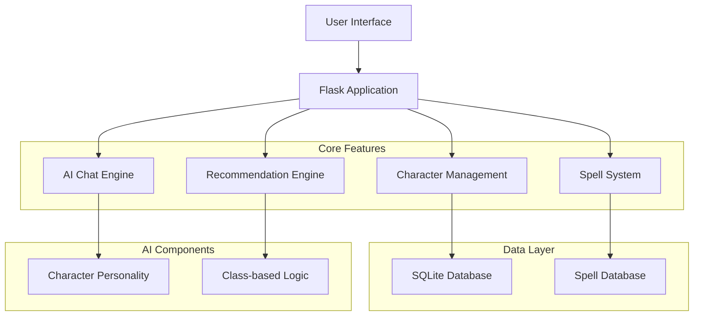

# EchoSheet - Intelligent D&D Character Management

A modern web application that brings your Dungeons & Dragons 5e characters to life through intelligent automation and interactive features. Built with Flask and designed for both new players and experienced dungeon masters.

## Overview

EchoSheet transforms the traditional character creation process by combining the rules of D&D 5e with smart automation. Whether you're a first-time player or a veteran adventurer, the application helps you create compelling characters while ensuring they follow the game's rules and best practices.

## Key Features

- **Smart Auto-Fill**: Automatically generates attributes, skills, and spell selections based on your character's class and race
- **Intelligent Recommendations**: Get personalized suggestions for spell choices, skill improvements, and character optimization
- **Interactive Character Chat**: Engage in conversations with your character to develop their personality and backstory
- **Modern, Responsive Design**: Clean interface that works seamlessly on desktop and mobile devices
- **SRD Compliance**: Uses only content from the System Reference Document to ensure legal compliance

## Architecture



## Technology Stack

- **Backend**: Python Flask with SQLite database
- **Frontend**: HTML5, CSS3, Vanilla JavaScript
- **Testing**: pytest with coverage reporting
- **Deployment**: GitHub Actions CI/CD with Render hosting
- **Design**: Responsive CSS Grid and Flexbox

## Getting Started

### Prerequisites

- Python 3.8 or higher
- pip package manager

### Local Development

1. Clone the repository
   ```bash
   git clone <repository-url>
   cd EchoSheet
   ```

2. Install dependencies
   ```bash
   pip install -r requirements.txt
   ```

3. Run the application
   ```bash
   python app.py
   ```

4. Open your browser and navigate to `http://localhost:5000`

### Testing

Run the test suite to ensure everything is working correctly:

```bash
# Run all tests
pytest

# Run with coverage report
pytest --cov=app --cov-report=term-missing

# Run specific test file
pytest tests/test_app.py -v
```

## Deployment

This project includes automated deployment through GitHub Actions. When you push to the main branch:

1. **Continuous Integration**: Tests run automatically on Python 3.11
2. **Quality Checks**: Code coverage and test results are reported
3. **Automatic Deployment**: If tests pass, the application deploys to Render

### Manual Deployment

To deploy manually to Render:

1. Connect your GitHub repository to Render
2. Configure the service with:
   - Build Command: `pip install -r requirements.txt`
   - Start Command: `gunicorn app:app --bind 0.0.0.0:$PORT`
   - Environment: Python 3.11.7

## Usage Guide

### Creating Your First Character

1. Navigate to the main page and click "Create New Character"
2. Fill in basic information: name, race, class, and level
3. Use the "Auto-Fill" feature to generate optimized attributes and skills
4. Review the character preview and click "Create Character"

### Managing Your Characters

- **View Character Sheets**: Access detailed character information from the main page
- **Interactive Recommendations**: Get personalized suggestions for improvements
- **Character Development**: Use the chat feature to develop your character's personality

### Spell Management

- Browse available spells by class and level
- Get intelligent suggestions based on your character's build
- Validate spell selections against D&D 5e rules

## Supported Content

### Races
Human, Elf, Dwarf, Halfling, Dragonborn, Tiefling, Half-Elf, Half-Orc, Gnome

### Classes
Fighter, Wizard, Cleric, Rogue, Ranger, Paladin, Bard, Sorcerer, Warlock, Monk, Druid, Barbarian

### Backgrounds
Acolyte, Criminal, Folk Hero, Noble, Sage, Soldier

*Note: All content is sourced from the D&D 5e System Reference Document (SRD) to ensure legal compliance.*

## Development Workflow

1. **Feature Development**: Create feature branches for new functionality
2. **Local Testing**: Run tests before committing changes
3. **Pull Requests**: Submit PRs for review and automated testing
4. **Continuous Integration**: GitHub Actions validates your changes
5. **Automatic Deployment**: Successful merges to main trigger deployment

## Contributing

We welcome contributions from the community! Here's how you can help:

1. Fork the repository
2. Create a feature branch (`git checkout -b feature/amazing-feature`)
3. Make your changes and test thoroughly
4. Commit your changes (`git commit -m 'Add amazing feature'`)
5. Push to the branch (`git push origin feature/amazing-feature`)
6. Open a Pull Request

### Development Guidelines

- Write tests for new functionality
- Ensure all tests pass before submitting PRs
- Follow the existing code style and structure
- Update documentation for significant changes

## Project Status

### Completed Features
- Character creation and management system
- Automated attribute and skill generation
- Intelligent spell recommendations
- Interactive character chat system
- Modern, responsive user interface
- Comprehensive test suite
- Automated CI/CD pipeline

### Planned Enhancements
- User authentication and account management
- PDF export functionality
- Campaign management features
- Real-time multiplayer features
- Additional races, classes, and subclasses
- Inventory management system
- Adventure history tracking

## License

This project is licensed under the MIT License - see the [LICENSE](LICENSE) file for details.

## Acknowledgments

- Wizards of the Coast for creating Dungeons & Dragons
- The D&D community for inspiration and feedback
- Contributors to Flask and other open-source libraries used in this project

---

*May your adventures be epic and your dice rolls be fortunate!* 